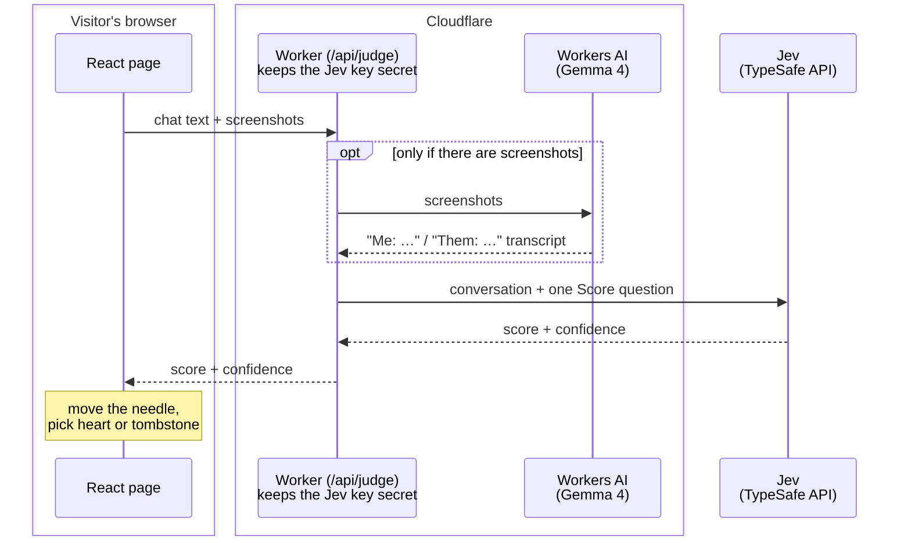

# Am I friendzoned? 💔

Paste your DMs or drop in screenshots, and a meter tells you where you stand.

**Live: https://friendzone.vincenth19.com**


It's a joke site, but also a small, complete example you can learn from. It shows how to:

- get a **typed, scored answer** from an AI model (Jev by [TypeSafe AI](https://docs.typesafe.ai/)) instead of a paragraph of text,
- **read chat screenshots** with an AI vision model,
- keep an **API key secret** while the page runs in the visitor's browser,
- ship the page and its backend together on **Cloudflare Workers** with one command.

The whole app is under 400 lines of code.

## What happens when you press "Check my chances"

1. Your browser sends the chat (typed text, screenshots, or both) to the site's small backend.
2. If there are screenshots, the backend asks a vision model to type out the messages and mark who sent each one: `Me:` or `Them:`.
3. The backend sends the conversation to Jev with one question: on a scale from 0 (they're into you) to 4 (fully friendzoned), where is this?
4. Jev answers with a **score** (for example 3.2) and a **confidence** (how sure it is, from 0 to 1).
5. The page moves the needle to the score. If the score is high *and* Jev is sure, the heart becomes a tombstone. Otherwise it's happy.

## Architecture



There are only two parts you write: a **page** that runs in the browser and a **Worker** that runs on Cloudflare. Everything else is a service they call.

### The page: a React single-page app

**What it is:** the whole site is one HTML page. [React](https://react.dev) updates it in place as you type, submit, and get a result. [Vite](https://vite.dev) bundles it into a few static files.

**Why:** it's one interactive screen with no other pages, so there's nothing to render on a server. [Tailwind CSS](https://tailwindcss.com) handles styling and [Motion](https://motion.dev) handles the animations: the trembling heart, the swinging needle, the falling tombstone.

### The backend: a Cloudflare Worker

**What it is:** a small function that runs on Cloudflare's servers each time a request comes in. There's no server for you to manage.

**Why you need a backend at all:** the Jev API key. The page runs on the visitor's computer, so anything in it (including an API key) can be read by anyone who opens the browser's developer tools. They could copy the key and spend your credit. The Worker stores the key as a Cloudflare *secret* and calls Jev on the page's behalf, so the key never reaches the browser.

**Why Cloudflare:** the same Worker also serves the page's files, so one `deploy` publishes the frontend and backend together on one domain. The page calls `/api/judge` on its own site, so there's no cross-site setup. Cloudflare also runs AI models next to the Worker, which is how the screenshot reading works. The free tier is enough for a site like this.

### Reading screenshots: Gemma 4 on Workers AI

**What it is:** [Workers AI](https://developers.cloudflare.com/workers-ai/) runs open AI models on Cloudflare. The Worker reaches it through a *binding*: a connection declared in `wrangler.jsonc` that shows up in code as `env.AI`. You don't need an extra API key.

**Why it's needed:** Jev only reads text, so screenshots have to become text first.

**Why a vision model instead of classic OCR** (optical character recognition, the tech that turns pictures of text into text): classic OCR tools like Tesseract give you the words but not *who said them*, and that's the whole question. A vision model understands the layout of a chat: bubbles on the right are yours, bubbles on the left are theirs. It's told to write the messages out as `Me:` and `Them:` lines.

**Why thinking is turned off:** Gemma 4 can "think" before answering. For copying text out of an image that doesn't help. With thinking on, each screenshot took about 45 seconds and cost 3–4 times more. With it off, it takes about 8 seconds with the same result.

### The judgment: Jev

**What it is:** [Jev](https://docs.typesafe.ai/) is a model built for software to call. You give it some content (the *state*) and typed questions, and it returns typed answers: a choice, a yes-probability, or a score, each with probabilities and a confidence.

**Why not just ask a chatbot "am I friendzoned?":** a chatbot replies with a paragraph. Your code would have to dig a number out of it, the wording changes between runs, and there's no honest measure of how sure it is. Jev returns a number the page can use directly to move the needle, plus a confidence the page can use to decide what to show. It's also cheap: a check costs about $0.00002.

## The Jev question, step by step

Jev has three question types:

| Type | Answers | Example |
| --- | --- | --- |
| Choice | Which option from a set | "Which team handles this ticket?" |
| Noul | Probability the answer is yes | "Does this message sound urgent?" |
| Score | Position on an ordered scale | "How friendzoned is this?" |

Being friendzoned is a scale with in-betweens, so this app uses a **Score** question. From [worker/index.ts](worker/index.ts):

```ts
jev.systemOne({
  state: {
    conversation, // "Me: …\nThem: …"
    roles: "Me is the person asking. Them is the person Me has a crush on.",
  },
  questions: {
    friendzone: score("Based on how Them talks to Me, how does Them see Me?", [
      "Them flirts with Me or shows clear romantic interest: compliments on looks, pet names, asking Me out or for time alone",
      "Them is warm and playful with Me and curious about Me, with some hints of romantic interest",
      "Them is friendly and polite with Me, with no romantic signals either way",
      "Them treats Me as a friend: platonic plans, calls Me buddy or bestie, talks about crushes on other people",
      "Them says they only see Me as a friend or sibling, turns Me down, or is dating someone else",
    ]),
  },
});
```

The five strings are the levels, numbered 0 to 4. Tips for writing your own:

- **Describe situations, not amounts.** Jev compares each level with the chat on its own, without seeing its number or the other levels. "Calls Me buddy or bestie" is something it can look for in the chat. "Somewhat friendzoned" isn't.
- **Name the people.** Jev takes wording literally. Saying `Me` and `Them` everywhere, and explaining them in `roles`, makes it clear whose feelings are being rated.
- **Send the state as an object.** Named fields (`conversation`, `roles`) keep the chat separate from the notes about it.

### What comes back

The real response for "can I bring my girlfriend? you're like a brother to me fr":

```json
{
  "model": "jev-1.13.0",
  "answers": {
    "friendzone": {
      "type": "score",
      "score": 3.98,
      "confidence": 0.98,
      "probabilities": { "0": 0.0, "1": 0.0, "2": 0.0, "3": 0.02, "4": 0.98 },
      "legend": { "0": "Them flirts with Me…", "4": "Them says they only see Me as a friend…" }
    }
  },
  "usage": { "input_tokens": 475, "output_tokens": 19 }
}
```

(`legend` is shortened here. It repeats all five levels.)

- **`probabilities`**: how likely each level is. They add up to 1.
- **`score`**: the average level, weighted by those probabilities: 3 × 0.02 + 4 × 0.98 = 3.98. The page shows `score ÷ 4` as a percentage, so this reads "100% friendzoned".
- **`confidence`**: how concentrated the probabilities are. All of it on one level means close to 1. Spread across several levels means lower.

### Confidence decides the tombstone

The score says *how* friendzoned. Confidence says *how sure* Jev is. The rule for the tombstone lives in the page's code ([src/main.tsx](src/main.tsx)), so you can change it without touching the question:

```ts
const friendzoned = verdict.score >= 2.5 && verdict.confidence >= 0.5;
```

Everything else gets the happy heart, so mixed signals get the benefit of the doubt. Real results:

| What Them said | score | confidence | Result |
| --- | --- | --- | --- |
| "omg yes!! I've been wanting to ask you the same thing 😳 you looked so good today btw" | 0.00 | 1.00 | happy |
| "me too :) we should hang out again sometime" | 1.73 | 0.76 | happy |
| "aww thank you!! ur the best, love you lots 💕 we need to catch up soon bestie" | 2.84 | 0.86 | tombstone |
| "can I bring my girlfriend? you're like a brother to me fr" | 3.98 | 0.98 | tombstone |

In the "hang out again" row, Jev put 0.72 on level 2 (friendly, no signals) and 0.27 on level 1 (hints of interest). That split is why the score falls between the two levels and the confidence is lower.

## What it costs

| Part | Cost per check |
| --- | --- |
| Jev | About 475 input tokens at $0.042 per million, so roughly $0.00002. Output is free. |
| Reading screenshots | About 5 *neurons* (Cloudflare's usage unit) per screenshot. Workers AI includes 10,000 free neurons a day, which is about 400 checks with 5 screenshots each. After that, $0.011 per 1,000 neurons. |
| Worker and page files | Covered by Cloudflare's free tier or the $5 Workers plan. |

## Run it yourself

You need:

- [Bun](https://bun.sh), to install packages and run scripts
- a free [Cloudflare account](https://dash.cloudflare.com/sign-up)
- a TypeSafe API key from [console.typesafe.ai](https://console.typesafe.ai/keys)

**1. Get the code and install packages**

```bash
git clone https://github.com/vincenth19/am-i-friendzoned.git
cd am-i-friendzoned
bun install
```

**2. Add your TypeSafe key.** It goes in a `.env` file, which git ignores so the key is never committed.

```bash
echo "TYPESAFE_AI_API_KEY=your-key" > .env
```

**3. Log in to Cloudflare.** This opens your browser. It's needed even for local development, because Workers AI always runs on Cloudflare's servers.

```bash
bunx wrangler login
```

**4. Start it locally.** This runs the page and the Worker together at http://localhost:5173 and reloads when you edit files.

```bash
bun dev
```

**5. Put it online.** First open [wrangler.jsonc](wrangler.jsonc) and delete the `routes` line (it points at this site's domain). Without it you get a free `*.workers.dev` address. Then deploy, and upload your key as a secret:

```bash
bun run deploy
```
```bash
bunx wrangler secret put TYPESAFE_AI_API_KEY
```

## Project files

| File | What it does |
| --- | --- |
| [worker/index.ts](worker/index.ts) | The backend: reads screenshots with Gemma, then asks Jev |
| [src/main.tsx](src/main.tsx) | The page: form, result text, tombstone rule |
| [src/Stage.tsx](src/Stage.tsx) | The gauge: meter, needle, heart and tombstone, drawn in SVG and animated with Motion |
| [src/index.css](src/index.css) | Colours and fonts, based on candy conversation hearts |
| [wrangler.jsonc](wrangler.jsonc) | Cloudflare config: page files, the AI binding, the custom domain |
| [vite.config.ts](vite.config.ts) | Build config; the Cloudflare plugin lets `bun dev` run the Worker locally |

## Privacy

The Worker doesn't store anything. Your text and screenshots are sent to Cloudflare Workers AI and TypeSafe to be processed.

## License

[MIT](LICENSE)
