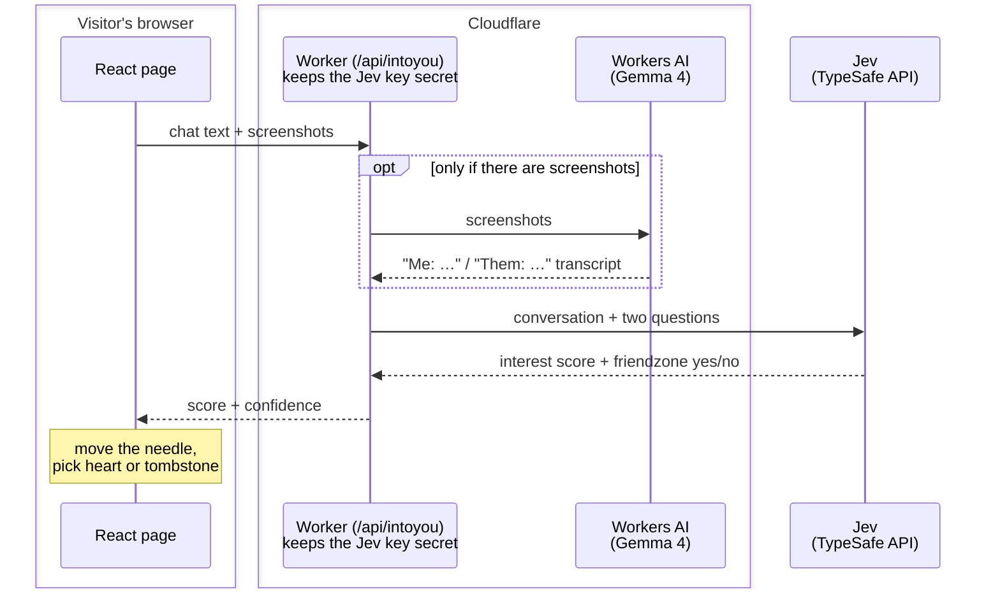

# Jev testing

Small apps built on **[Jev](https://docs.typesafe.ai/)**, TypeSafe AI's model that returns typed answers with calibrated probabilities instead of text.

**Live: https://jev.vincenth19.com**

| App | What it does |
| --- | --- |
| [Are they into you? 💘](https://jev.vincenth19.com/intoyou/) | Paste your DMs or screenshots, and a meter tells you where you stand: **Cooked** or **Down bad**. |
| [Finder 🔎](https://jev.vincenth19.com/finder/) | Open a PDF and ask it questions. The answers are highlighted in the document. |

They're small on purpose, so you can learn from them. Together they show how to:

- get **typed, scored answers** from an AI model instead of a paragraph of text,
- **combine simple questions** in code instead of asking one complicated one,
- **search a document and cite the exact line**, with no chatbot involved,
- **read chat screenshots** with an AI vision model,
- keep an **API key secret** while the page runs in the visitor's browser,
- ship several pages and their backend together on **Cloudflare Workers** with one command.

## How the site is built

There are only two kinds of parts you write:

- **Pages** that run in the browser: one per app, plus the index that links to them.
- **One Worker** that runs on Cloudflare and answers each app's API: `/api/intoyou` and `/api/finder`.

Everything else is a service they call.

### The pages: React

**What they are:** each app is one HTML page. [React](https://react.dev) updates it in place as you type, submit, and get a result. [Vite](https://vite.dev) builds all the pages in one go ([vite.config.ts](vite.config.ts) lists them). [Tailwind CSS](https://tailwindcss.com) handles styling and [Motion](https://motion.dev) the animations.

**Why:** each app is a single interactive screen, so there's nothing to render on a server.

### The backend: a Cloudflare Worker

**What it is:** a small function that runs on Cloudflare's servers each time a request comes in. There's no server for you to manage. [worker/index.ts](worker/index.ts) is a short router that sends each `/api/…` request to its app's handler.

**Why you need a backend at all:** the Jev API key. A page runs on the visitor's computer, so anything in it (including an API key) can be read by anyone who opens the browser's developer tools. They could copy the key and spend your credit. The Worker stores the key as a Cloudflare *secret* and calls Jev on the page's behalf, so the key never reaches the browser.

**Why Cloudflare:** the same Worker also serves the pages, so one `deploy` publishes everything on one domain, and the pages call `/api/…` on their own site without any cross-site setup. Cloudflare also runs AI models next to the Worker, which is how Into You reads screenshots. The free tier is enough for sites like these.

### The judgment: Jev

**What it is:** Jev is a model built for software to call. You give it some content (the *state*) and typed questions, and it returns typed answers, each with probabilities:

| Question type | Answers | Example |
| --- | --- | --- |
| Choice | Which option from a set | "Which line answers this question?" |
| Noul | Probability the answer is yes | "Did they say you're just a friend?" |
| Score | Position on an ordered scale | "How interested are they?" |

**Why not just ask a chatbot:** a chatbot replies with a paragraph. Your code would have to dig the answer out of it, the wording changes between runs, and there's no honest measure of how sure it is. Jev returns numbers and ids your code can use directly, plus a confidence your code can use to decide what to do. It's also fast (about a second) and cheap (fractions of a cent per request).

## Are they into you? 💘


### What happens when you press "Check the vibe"

1. Your browser sends the chat (typed text, screenshots, or both) to the Worker.
2. If there are screenshots, the Worker asks a vision model to type out the messages and mark who sent each one: `Me:` or `Them:`.
3. The Worker sends the conversation to Jev with two questions:
   - **How interested are they?** On a scale from 0 (dry one-word replies) to 4 (openly flirting).
   - **Did they friendzone you?** Yes or no: did they say you're "just a friend", or mention a partner?
4. Jev answers each one with a number and how sure it is.
5. The page moves the needle and picks the ending. If they're clearly not interested, or they friendzoned you, the heart becomes a tombstone and the page turns grey. Otherwise the heart is happy and the page turns pink.



### Reading screenshots: Gemma 4 on Workers AI

**What it is:** [Workers AI](https://developers.cloudflare.com/workers-ai/) runs open AI models on Cloudflare. The Worker reaches it through a *binding*: a connection declared in `wrangler.jsonc` that shows up in code as `env.AI`. You don't need an extra API key.

**Why it's needed:** Jev only reads text, so screenshots have to become text first.

**Why a vision model instead of classic OCR** (optical character recognition, the tech that turns pictures of text into text): classic OCR tools like Tesseract give you the words but not *who said them*, and that's the whole question. A vision model understands the layout of a chat: bubbles on the right are yours, bubbles on the left are theirs.

**Why thinking is turned off:** Gemma 4 can "think" before answering. For copying text out of an image that doesn't help. With thinking on, each screenshot took about 45 seconds and cost 3–4 times more. With it off, it takes about 8 seconds with the same result.

### The Jev questions

From [worker/intoyou.ts](worker/intoyou.ts):

```ts
jev.systemOne({
  state: {
    conversation, // "Me: …\nThem: …"
    roles: "Me is the person asking. Them is the person Me is texting.",
  },
  questions: {
    interest: score("Based on how Them texts Me, how interested is Them in Me?", [
      "Them gives dry one-word replies, ignores Me's questions, or turns Me down",
      "Them replies politely but briefly, rarely asks Me anything, and doesn't build on the conversation",
      "Them is friendly and engaged with Me, with no romantic signals either way",
      "Them puts effort into talking to Me: long replies, asks Me questions, playful emoji, keeps the chat going",
      "Them flirts with Me, compliments Me, suggests plans or time alone, or says they like Me",
    ]),
    friendzoned: noul("Them says they only see Me as a friend or family, or that they are dating someone else"),
  },
});
```

The five strings in the Score are its levels, numbered 0 to 4. Tips for writing your own:

- **Describe situations, not amounts.** Jev compares each level with the chat on its own, without seeing its number or the other levels. "Asks Me questions" is something it can look for in the chat. "Pretty interested" isn't.
- **Name the people.** Jev takes wording literally. Saying `Me` and `Them` everywhere, and explaining them in `roles`, makes it clear whose feelings are being rated.
- **Keep each question to one thing.** See the next section.

### Why two questions instead of one

The first version had a single Score, with "says they only see Me as a friend" as part of level 0. Then this screenshot came in:

> **Them:** omg that sounds fun!!<br>
> **Them:** can I bring Jordan? he's been dying to meet my best friend 🥰<br>
> **Them:** ur literally the brother I never had lol

Enthusiastic, lots of emoji, *and* a clear friendzone. The single question was measuring two things at once (effort and "friend only"), so Jev spread its answer across both ends of the scale and came back with **0% confidence**. The Jev docs warn about this: when one question measures two things, it can't place a message that is high on one and low on the other.

The fix is to ask each thing separately and combine the answers in code. Here's the real response for that chat with the two questions:

```json
{
  "model": "jev-1.13.0",
  "answers": {
    "interest": {
      "type": "score",
      "score": 3.04,
      "confidence": 0.54,
      "probabilities": { "0": 0.0, "1": 0.0, "2": 0.25, "3": 0.46, "4": 0.29 }
    },
    "friendzoned": { "type": "noul", "noul": 0.83 }
  },
  "usage": { "input_tokens": 512, "output_tokens": 36 }
}
```

(Score answers also include a `legend` that repeats the levels. It's left out here.)

- **`probabilities`**: how likely each level is. They add up to 1.
- **`score`**: the average level, weighted by those probabilities: 2 × 0.25 + 3 × 0.46 + 4 × 0.29 = 3.04. The page shows `score ÷ 4` as a percentage.
- **`confidence`**: how concentrated the probabilities are. All of it on one level means close to 1. Spread across several levels means lower.
- **`noul`**: the probability that the yes/no statement is true. Here, 83% that they friendzoned you.

On effort alone this chat looks good: 3.04, "putting in effort". The Noul catches what the Score can't. The Worker then applies one rule: **being friendzoned outranks effort**.

```ts
friendzoned.noul >= 0.5
  ? { score: 0, confidence: friendzoned.noul, friendzoned: true }
  : { score: interest.score, confidence: interest.confidence, friendzoned: false }
```

### Confidence decides the tombstone

The score says *how* interested they are. Confidence says *how sure* Jev is. The page shows the tombstone only when the score is low *and* Jev is sure about it ([src/intoyou/main.tsx](src/intoyou/main.tsx)):

```ts
const cooked = verdict.score <= 1.5 && verdict.confidence >= 0.5;
```

Everything else gets the happy heart, so mixed signals get the benefit of the doubt. Real results:

| What Them said | Interest | Sure | Friendzoned? | Result |
| --- | --- | --- | --- | --- |
| "ya" … "friends" | 0.89 | 90% | no | cooked |
| "me too, thanks for coming" | 1.41 | 66% | no | cooked |
| "can I bring my boyfriend? 🥰" | | 84% | **yes** | friendzoned |
| "can I bring my girlfriend? you're like a brother to me fr" | | 97% | **yes** | friendzoned |
| "me too :) we should hang out again sometime" | 2.68 | 38% | no | mixed signals, happy |
| "so tired 😩 wbu? did you finish that painting??" | 2.88 | 90% | no | putting in effort |
| "I've been wanting to ask you the same thing 😳 you looked so good today" | 4.00 | 100% | no | down bad |

"ya" … "friends" is a good test of the Noul: the word "friends" is there, but nobody is being friendzoned, and Jev can tell.

### What it costs

| Part | Cost per check |
| --- | --- |
| Jev | About 510 input tokens at $0.042 per million, so roughly $0.00002. Output is free. |
| Reading screenshots | About 5 *neurons* (Cloudflare's usage unit) per screenshot. Workers AI includes 10,000 free neurons a day, which is about 400 checks with 5 screenshots each. After that, $0.011 per 1,000 neurons. |

## Finder 🔎

Open a PDF and ask it questions. Each answer is a quote from the PDF, highlighted where it appears, with a numbered badge that links it to its question. If the PDF doesn't answer a question, Finder says so.

### What happens when you ask a question

1. **In your browser,** [pdf-inspector](https://github.com/firecrawl/pdf-inspector) (compiled to WebAssembly) pulls the text out of the PDF in reading order. Finder splits it into sentences and notes which page each is on. The PDF itself is never uploaded.
2. The sentences and your question go to the Worker, which asks Jev two questions about them (below).
3. Jev returns which sentences answer the question, and how likely it is that any of them do.
4. **Back in your browser,** [pdf.js](https://mozilla.github.io/pdf.js/) draws the pages, finds each cited sentence on its page, and highlights it. Clicking a highlight shows its finding; clicking a finding scrolls the PDF to it.

### The Jev pattern: point at a line

This is Jev's own [line-by-line search](https://docs.typesafe.ai/cookbooks/semantic_find) recipe. From [worker/finder.ts](worker/finder.ts):

```ts
jev.systemOne({
  // Every sentence gets an id: "L0| …", "L1| …"
  state: ids.map((id, i) => `${id}| ${lines[i]}`).join("\n"),
  questions: {
    where: choice(`Which line of the document contains the answer to: "${question}"?`,
      Object.fromEntries(ids.map((id) => [id, null]))),
    exists: noul(`Does any line of the document address or answer: "${question}"?`, { … }),
  },
});
```

- **`where`** is a Choice whose options are the sentence ids. Jev returns a probability for every sentence, so "pick an option" becomes "point at a sentence". The id it points at *is* the citation. It can only point at text that exists, so there's no invented quote to check.
- **`exists`** is a Noul, because a Choice always spreads 100% across its options: some sentence ranks first even when none answers the question. The Noul catches that.

When an answer spans several sentences, Jev splits the probability between them, so Finder shows every sentence above 15%.

### Real results

Eight questions about a 5-page research update on weather forecasts for grain growers (102 sentences), sent together in one request:

| Question | Where Jev pointed | Right? |
| --- | --- | --- |
| How much canola did the growers sow, and what happened? | "…sow 1,000ha of canola…" and "…fell dramatically (from over 60 mm to just 2 mm)…" (split 59% / 41%) | ✅ both halves |
| Why did the Yr.no forecast keep changing? | "…thunderstorms are localised events…" (100%) | ✅ |
| How much rain fell in Dubbo on 25 November? | "Dubbo 0.2 mm" (99%) | ✅ |
| Who funds the Agri-Climate Outlooks project? | "With funding from Agricultural Innovation Australia…" (92%) | ✅ |
| How can I contact the team? | the email line and the contact details (split 53% / 45%) | ✅ both |
| When did the Bureau warn about the storms? | "…video update… released on 8 November 2023…" (96%) | ✅ |
| What is the price of canola seed? | `exists`: **2%**, so "Not in this PDF" | ✅ |
| Does the paper recommend relying on Yr.no? | the conclusion's "rather than to rely on one popular online resource" | ✅ |

All eight took **about 1 second and cost $0.0005** together (11,440 input tokens).

### Why no LLM?

Finding and citing needs none: the question drops into a fixed template. An LLM would only help with things Jev can't do:

- **Writing a sentence-long answer** from the cited lines. Jev doesn't generate text. A small model could, from just the cited sentences, as an add-on.
- **Splitting a compound question** ("who funds it and how do I contact them?") into separate searches.

### Finding the highlight

pdf-inspector's browser build gives clean text in reading order, but not where each word sits on the page. pdf.js gives positions. Finder matches the two by comparing letters and digits only, so differences in spacing, hyphenation and punctuation don't matter. On the sample paper it located 101 of 102 sentences; the one miss was a chart's axis labels.

### Limits

- **Length:** one Choice takes up to 255 options, so longer PDFs are searched in chunks of 250 sentences, all at the same time. Finder caps a PDF at 2,000 sentences (roughly 80 pages).
- **Scanned PDFs** have no text to extract and would need OCR first.
- **Highlights cover whole printed lines,** so the end of a highlight can include the start of the next sentence.

## Run it yourself

You need:

- [Bun](https://bun.sh), to install packages and run scripts
- a free [Cloudflare account](https://dash.cloudflare.com/sign-up)
- a TypeSafe API key from [console.typesafe.ai](https://console.typesafe.ai/keys)

**1. Get the code and install packages**

```bash
git clone https://github.com/vincenth19/jev-testing.git
cd jev-testing
bun install
```

**2. Add your TypeSafe key.** It goes in a `.env` file, which git ignores so the key is never committed.

```bash
echo "TYPESAFE_AI_API_KEY=your-key" > .env
```

**3. Log in to Cloudflare.** This opens your browser. It's needed even for local development, because Workers AI always runs on Cloudflare's servers.

```bash
bunx wrangler login
```

**4. Start it locally.** This runs every page and the Worker together at http://localhost:5173 (the apps are at `/intoyou/` and `/finder/`) and reloads when you edit files.

```bash
bun dev
```

**5. Put it online.** First open [wrangler.jsonc](wrangler.jsonc) and delete the `routes` line (it points at this site's domain). Without it you get a free `*.workers.dev` address. Then deploy, and upload your key as a secret:

```bash
bun run deploy
```
```bash
bunx wrangler secret put TYPESAFE_AI_API_KEY
```

## Project files

| File | What it does |
| --- | --- |
| [index.html](index.html) | The index page that links to each app |
| [worker/index.ts](worker/index.ts) | Routes each `/api/…` request to its app |
| [worker/intoyou.ts](worker/intoyou.ts) | Into You's backend: reads screenshots with Gemma, asks Jev both questions, combines the answers |
| [worker/finder.ts](worker/finder.ts) | Finder's backend: searches the sentences with Jev, in chunks |
| [src/intoyou/](src/intoyou/) | Into You's page: the gauge, heart and tombstone ([Stage.tsx](src/intoyou/Stage.tsx)), the form and verdict ([main.tsx](src/intoyou/main.tsx)), colours and textures ([index.css](src/intoyou/index.css)) |
| [src/finder/](src/finder/) | Finder's page: PDF reading and highlight placement ([pdf.ts](src/finder/pdf.ts)), the viewer and findings panel ([main.tsx](src/finder/main.tsx)) |
| [wrangler.jsonc](wrangler.jsonc) | Cloudflare config: page files, the AI binding, the custom domain |
| [vite.config.ts](vite.config.ts) | Build config: the list of pages, and the Cloudflare plugin that lets `bun dev` run the Worker locally |

## Privacy

The Worker doesn't store anything. Into You sends your text and screenshots to Cloudflare Workers AI and TypeSafe to be processed. Finder reads your PDF in your browser and sends only its extracted text and your questions to TypeSafe.

## License

[MIT](LICENSE)
