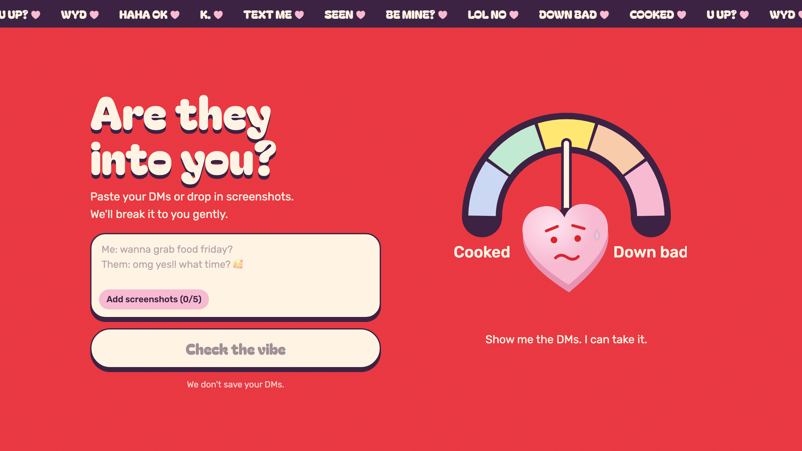

# Are they into you? 💘

Paste your DMs or drop in screenshots, and a meter tells you where you stand: **Cooked** or **Down bad**.

**Live: https://intoyou.vincenth19.com**



It's a joke site, but also a small, complete example you can learn from. It shows how to:

- get **typed, scored answers** from an AI model (Jev by [TypeSafe AI](https://docs.typesafe.ai/)) instead of a paragraph of text,
- **combine two simple questions** in code instead of asking one complicated one,
- **read chat screenshots** with an AI vision model,
- keep an **API key secret** while the page runs in the visitor's browser,
- ship the page and its backend together on **Cloudflare Workers** with one command.

The whole app is under 450 lines of code.

## What happens when you press "Check the vibe"

1. Your browser sends the chat (typed text, screenshots, or both) to the site's small backend.
2. If there are screenshots, the backend asks a vision model to type out the messages and mark who sent each one: `Me:` or `Them:`.
3. The backend sends the conversation to Jev with two questions:
   - **How interested are they?** On a scale from 0 (dry one-word replies) to 4 (openly flirting).
   - **Did they friendzone you?** Yes or no: did they say you're "just a friend", or mention a partner?
4. Jev answers each one with a number and how sure it is.
5. The page moves the needle and picks the ending. If they're clearly not interested, or they friendzoned you, the heart becomes a tombstone and the page turns grey. Otherwise the heart is happy and the page turns pink.

## Architecture


There are only two parts you write: a **page** that runs in the browser and a **Worker** that runs on Cloudflare. Everything else is a service they call.

### The page: a React single-page app

**What it is:** the whole site is one HTML page. [React](https://react.dev) updates it in place as you type, submit, and get a result. [Vite](https://vite.dev) bundles it into a few static files.

**Why:** it's one interactive screen with no other pages, so there's nothing to render on a server. [Tailwind CSS](https://tailwindcss.com) handles styling and [Motion](https://motion.dev) handles the animations: the trembling heart, the swinging needle, the falling tombstone.

### The backend: a Cloudflare Worker

**What it is:** a small function that runs on Cloudflare's servers each time a request comes in. There's no server for you to manage.

**Why you need a backend at all:** the Jev API key. The page runs on the visitor's computer, so anything in it (including an API key) can be read by anyone who opens the browser's developer tools. They could copy the key and spend your credit. The Worker stores the key as a Cloudflare *secret* and calls Jev on the page's behalf, so the key never reaches the browser.

**Why Cloudflare:** the same Worker also serves the page's files, so one `deploy` publishes the frontend and backend together on one domain. The page calls `/api/judge` on its own site, so there's no cross-site setup. Cloudflare also runs AI models next to the Worker, which is how the screenshot reading works. The free tier is enough for a site like this.

### Reading screenshots: Gemma 4 on Workers AI

**What it is:** [Workers AI](https://developers.cloudflare.com/workers-ai/) runs open AI models on Cloudflare. The Worker reaches it through a *binding*: a connection declared in `wrangler.jsonc` that shows up in code as `env.AI`. You don't need an extra API key.

**Why it's needed:** Jev only reads text, so screenshots have to become text first.

**Why a vision model instead of classic OCR** (optical character recognition, the tech that turns pictures of text into text): classic OCR tools like Tesseract give you the words but not *who said them*, and that's the whole question. A vision model understands the layout of a chat: bubbles on the right are yours, bubbles on the left are theirs. It's told to write the messages out as `Me:` and `Them:` lines.

**Why thinking is turned off:** Gemma 4 can "think" before answering. For copying text out of an image that doesn't help. With thinking on, each screenshot took about 45 seconds and cost 3–4 times more. With it off, it takes about 8 seconds with the same result.

### The judgment: Jev

**What it is:** [Jev](https://docs.typesafe.ai/) is a model built for software to call. You give it some content (the *state*) and typed questions, and it returns typed answers: a choice, a yes-probability, or a score, each with probabilities and a confidence.

**Why not just ask a chatbot "are they into me?":** a chatbot replies with a paragraph. Your code would have to dig a number out of it, the wording changes between runs, and there's no honest measure of how sure it is. Jev returns numbers the page can use directly to move the needle, plus a confidence the page can use to decide what to show. It's also cheap: a check costs about $0.00002.

## The Jev questions, step by step

Jev has three question types:

| Type | Answers | Example |
| --- | --- | --- |
| Choice | Which option from a set | "Which team handles this ticket?" |
| Noul | Probability the answer is yes | "Did they say you're just a friend?" |
| Score | Position on an ordered scale | "How interested are they?" |

This app uses a **Score** and a **Noul**, sent together in one request. From [worker/index.ts](worker/index.ts):

```ts
jev.systemOne({
  state: {
    conversation, // "Me: …\nThem: …"
    roles: "Me is the person asking. Them is the person Me is texting.",
  },
  questions: {
    interest: score("Based on how Them texts Me, how interested is Them in Me?", [
      "Them gives dry one-word replies, ignores Me's questions, or turns Me down",
      "Them replies politely but briefly, rarely asks Me anything, and doesn't build on the conversation",
      "Them is friendly and engaged with Me, with no romantic signals either way",
      "Them puts effort into talking to Me: long replies, asks Me questions, playful emoji, keeps the chat going",
      "Them flirts with Me, compliments Me, suggests plans or time alone, or says they like Me",
    ]),
    friendzoned: noul("Them says they only see Me as a friend or family, or that they are dating someone else"),
  },
});
```

The five strings in the Score are its levels, numbered 0 to 4. Tips for writing your own:

- **Describe situations, not amounts.** Jev compares each level with the chat on its own, without seeing its number or the other levels. "Asks Me questions" is something it can look for in the chat. "Pretty interested" isn't.
- **Name the people.** Jev takes wording literally. Saying `Me` and `Them` everywhere, and explaining them in `roles`, makes it clear whose feelings are being rated.
- **Keep each question to one thing.** See the next section.

### Why two questions instead of one

The first version had a single Score, with "says they only see Me as a friend" as part of level 0. Then this screenshot came in:

> **Them:** omg that sounds fun!!<br>
> **Them:** can I bring Jordan? he's been dying to meet my best friend 🥰<br>
> **Them:** ur literally the brother I never had lol

Enthusiastic, lots of emoji, *and* a clear friendzone. The single question was measuring two things at once (effort and "friend only"), so Jev spread its answer across both ends of the scale and came back with **0% confidence**. The Jev docs warn about this: when one question measures two things, it can't place a message that is high on one and low on the other.

The fix is to ask each thing separately and combine the answers in code. Here's the real response for that chat with the two questions:

```json
{
  "model": "jev-1.13.0",
  "answers": {
    "interest": {
      "type": "score",
      "score": 3.04,
      "confidence": 0.54,
      "probabilities": { "0": 0.0, "1": 0.0, "2": 0.25, "3": 0.46, "4": 0.29 }
    },
    "friendzoned": { "type": "noul", "noul": 0.83 }
  },
  "usage": { "input_tokens": 512, "output_tokens": 36 }
}
```

(Score answers also include a `legend` that repeats the levels. It's left out here.)

- **`probabilities`**: how likely each level is. They add up to 1.
- **`score`**: the average level, weighted by those probabilities: 2 × 0.25 + 3 × 0.46 + 4 × 0.29 = 3.04. The page shows `score ÷ 4` as a percentage.
- **`confidence`**: how concentrated the probabilities are. All of it on one level means close to 1. Spread across several levels means lower.
- **`noul`**: the probability that the yes/no statement is true. Here, 83% that they friendzoned you.

On effort alone this chat looks good: 3.04, "putting in effort". The Noul catches what the Score can't. The Worker then applies one rule: **being friendzoned outranks effort**.

```ts
friendzoned.noul >= 0.5
  ? { score: 0, confidence: friendzoned.noul, friendzoned: true }
  : { score: interest.score, confidence: interest.confidence, friendzoned: false }
```

### Confidence decides the tombstone

The score says *how* interested they are. Confidence says *how sure* Jev is. The page shows the tombstone only when the score is low *and* Jev is sure about it ([src/main.tsx](src/main.tsx)):

```ts
const cooked = verdict.score <= 1.5 && verdict.confidence >= 0.5;
```

Everything else gets the happy heart, so mixed signals get the benefit of the doubt. Real results:

| What Them said | Interest | Sure | Friendzoned? | Result |
| --- | --- | --- | --- | --- |
| "ya" … "friends" | 0.89 | 90% | no | cooked |
| "me too, thanks for coming" | 1.41 | 66% | no | cooked |
| "can I bring my boyfriend? 🥰" | | 84% | **yes** | friendzoned |
| "can I bring my girlfriend? you're like a brother to me fr" | | 97% | **yes** | friendzoned |
| "me too :) we should hang out again sometime" | 2.68 | 38% | no | mixed signals, happy |
| "so tired 😩 wbu? did you finish that painting??" | 2.88 | 90% | no | putting in effort |
| "I've been wanting to ask you the same thing 😳 you looked so good today" | 4.00 | 100% | no | down bad |

"ya" … "friends" is a good test of the Noul: the word "friends" is there, but nobody is being friendzoned, and Jev can tell.

## What it costs

| Part | Cost per check |
| --- | --- |
| Jev | About 510 input tokens at $0.042 per million, so roughly $0.00002. Output is free. |
| Reading screenshots | About 5 *neurons* (Cloudflare's usage unit) per screenshot. Workers AI includes 10,000 free neurons a day, which is about 400 checks with 5 screenshots each. After that, $0.011 per 1,000 neurons. |
| Worker and page files | Covered by Cloudflare's free tier or the $5 Workers plan. |

## Run it yourself

You need:

- [Bun](https://bun.sh), to install packages and run scripts
- a free [Cloudflare account](https://dash.cloudflare.com/sign-up)
- a TypeSafe API key from [console.typesafe.ai](https://console.typesafe.ai/keys)

**1. Get the code and install packages**

```bash
git clone https://github.com/vincenth19/are-they-into-you.git
cd are-they-into-you
bun install
```

**2. Add your TypeSafe key.** It goes in a `.env` file, which git ignores so the key is never committed.

```bash
echo "TYPESAFE_AI_API_KEY=your-key" > .env
```

**3. Log in to Cloudflare.** This opens your browser. It's needed even for local development, because Workers AI always runs on Cloudflare's servers.

```bash
bunx wrangler login
```

**4. Start it locally.** This runs the page and the Worker together at http://localhost:5173 and reloads when you edit files.

```bash
bun dev
```

**5. Put it online.** First open [wrangler.jsonc](wrangler.jsonc) and delete the `routes` line (it points at this site's domain). Without it you get a free `*.workers.dev` address. Then deploy, and upload your key as a secret:

```bash
bun run deploy
```
```bash
bunx wrangler secret put TYPESAFE_AI_API_KEY
```

## Project files

| File | What it does |
| --- | --- |
| [worker/index.ts](worker/index.ts) | The backend: reads screenshots with Gemma, asks Jev both questions, combines the answers |
| [src/main.tsx](src/main.tsx) | The page: form, result text, tombstone rule, background colour |
| [src/Stage.tsx](src/Stage.tsx) | The gauge (meter, needle, heart, tombstone) and the scrolling ticker, drawn in SVG and animated with Motion |
| [src/index.css](src/index.css) | Colours, fonts, the chunky lettering and the film-grain texture |
| [wrangler.jsonc](wrangler.jsonc) | Cloudflare config: page files, the AI binding, the custom domain |
| [vite.config.ts](vite.config.ts) | Build config; the Cloudflare plugin lets `bun dev` run the Worker locally |

## Privacy

The Worker doesn't store anything. Your text and screenshots are sent to Cloudflare Workers AI and TypeSafe to be processed.

## License

[MIT](LICENSE)
